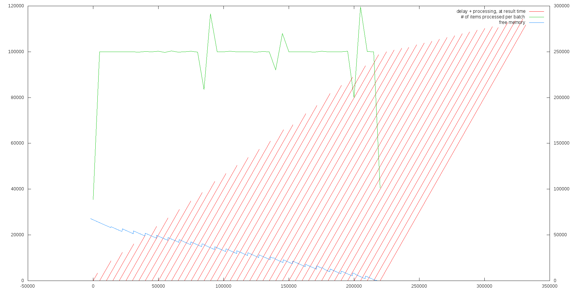

# Test runs

__For setup and all other details, look below__

## vanilla Spark 1.4.0, TCP receiver, no congestion strategy



## streaming back pressure branch, TCP receiver, congestion strategy: ignore


## streaming back pressure branch, TCP receiver, congestion strategy: drop


## streaming back pressure branch, TCP receiver, congestion strategy: sampling


## streaming back pressure branch, TCP receiver, congestion strategy: pushback

## streaming back pressure branch, reactive receiver

# Setup

The tests were executed on 3 m3.large ubuntu instances:

* 1 instance running the testbed application, providing the stream of data
* 2 instances running a 2 nodes Spark cluster:
  * node 1: Spark master + Spark slave
  * node 2: Spark streaming application + Spark slave\

## Test scenario

The test scenario is run using the [testbed application](https://github.com/skyluc/spark-streaming-testbed/tree/master/testbed).

It is a Play/Akka application which pushes a stream of numbers to clients connected to a specific port.

The test configuration is the following:

```
sequence = [
  { type = noop
    duration = 2
  }
  { type = fixed
    value = 6
    rate = 50000
    duration = 300
  }
]
```

The test scenario is a series of number `6`, sent at the rate of 50k per seconds.

## Test streaming application

The test streaming application does a resolution of the tower of Hanoi problem, for each number of the input stream. The number is used as the height of the tower.

Then does some statistics on the data from the batch: for each distinct value received:

* the number of time the value appears in the batch,
* the accumulated processing time
* the average processing time
* the standard deviation of the processing time.

### streaming application execution

The application is 

```
bin/spark-submit --class com.typesafe.spark.SimpleStreamingApp --master spark://ip-10-181-16-212:7077 <location/simple-streaming-app_2.10-0.1.6.jar> <testbed_ec2_internal_name> 2222 <congestion_strategy>
```

## Additional logs

Spark master, slaves and driver are running with the following additional configuration in `conf/log4j.properties`:

```
[...]
log4j.appender.console.target=System.out
[...]

# Change this to set Spark log level
log4j.logger.org.apache.spark=WARN

log4j.logger.org.apache.spark.storage.BlockManagerInfo=INFO

log4j.logger.org.apache.spark.streaming.receiver.ReceiverSupervisorImpl=DEBUG

```

# Log processing

The logs from the application (`run.log`), and from the executor running the stream receiver (`feedback.log`) are used

__TODO: fix the script to use the min timestamp__

```bash
# extract the intresting lines
grep $'\t7\t' run.log > execution.log
# find the earliest timestamp
BASE_TIME=$(head -1 execution.log | awk '{print $2}')
# shift the time, and keep only the interesting columns
awk -v baseTime=${BASE_TIME} -F '\t' '{print $1-baseTime"\t"$2-baseTime"\t"$1-$2"\t"$4;}' execution.log > execution-processed.log
```

```bash
# extract the intresting lines
grep 'Added input' run.log > memory.log
# shift the time and normalize the memory numbers (to KB).
awk -v baseTime=${BASE_TIME} -F '[\)\, -]' '{ if ($18 == "MB") { a = $17 * 1024} else {a = $17}; if ($22 == "MB") { b = $21 * 1024 } else { b = $21 }; print $11-baseTime"\t"a"\t"b;}' memory.log > memory-processed.log
```

```bash
grep 'Received update' SPARK_HOME/work/app-xxxxxxxxxxxx-000x/x/stdout > feedback.log
awk -v baseTime=${BASE_TIME} '{ cmd = "date --date=\""$1" "$2"\" +%s%3N"; cmd | getline a ; print a - baseTime,$10 - baseTime,$12 }' feedback.log > feedback-processed.log
```

## Plots

gnuplot script:

```
set y2range [0:]
set y2tics
set yrange [0:]
set boxwidth 1500 absolute
set style arrow 1 nohead ls 1

set terminal png size 2000,1000
set output "graph.png"

plot "execution-processed.log" using 2:(0):($1-$2):3 with vector title "delay + processing, at result time" arrowstyle 1, "" using 2:4 axes x1y2 with line title "# of items processed per batch", "memory-processed.log" using 1:($3/10) with lines title "free memory", "feedback-processed.log" using 1:($3 * 25) axes x1y2 with lines title "feedback bound"
```

